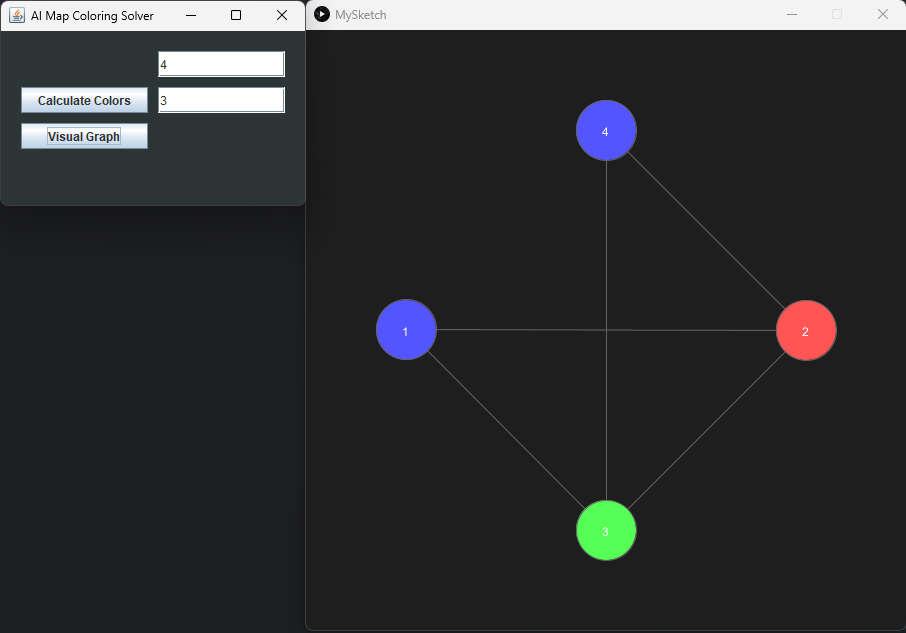
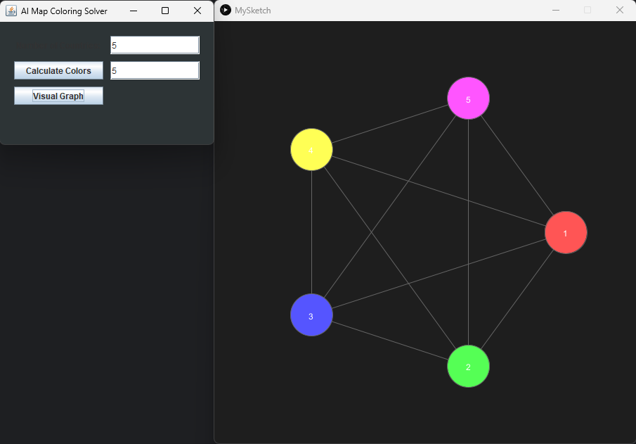

# 🗺️ Map Coloring - Constraint Satisfaction Problem (CSP)

This project utilizes Artificial Intelligence techniques to solve the famous "Map Coloring" problem. The goal is to assign colors to different regions such that no two adjacent regions share the same color, while minimizing the total number of colors used.

## 🧠 Algorithm & Logic
The project treats map coloring as a **Constraint Satisfaction Problem (CSP)** and relies on:
* **Backtracking Search**: A systematic approach to explore possible coloring solutions.
* **Heuristics**: Countries are sorted based on their number of borders (Degree) to prioritize the most constrained regions first.
* **State Space Search**: Each state is represented by the `countryPack` class, which tracks coloring progress and calculates the cost function $f(n)$ to guide the search.

---

## 🛠️ Technologies Used
* **Java 21**: Core programming language and Object-Oriented Logic.
* **Swing**: For building the Graphical User Interface (GUI).
* **Processing (Core Library)**: To generate the interactive visual graph of the regions.
* **Maven**: For managing external dependencies.

---

## 📸 Visualization Results
The application renders the map as a "Graph" where:
1. **Nodes (Circles)**: Represent countries or regions.
2. **Edges (Lines)**: Represent shared borders.
3. **Colors**: Represent the unique color assigned by the AI to each region.

### Example 1: 4 Regions (Solved with 3 Colors)

### Example 2: Complex Map with 5 Regions (Solved with 5 Colors)

