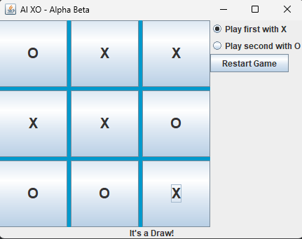
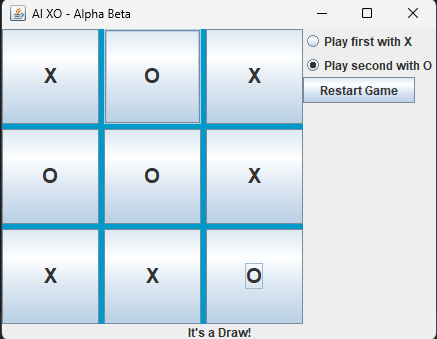
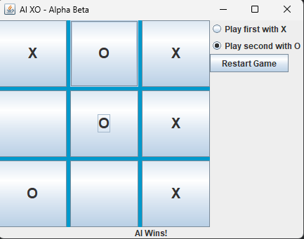

# 🎮 AI-Powered XO Game (Alpha-Beta Pruning)

An advanced Java implementation of the classic Tic-Tac-Toe game, featuring an unbeatable AI opponent driven by the **Minimax Algorithm** optimized with **Alpha-Beta Pruning**.

## 📸 Game Previews

| Playing as X (Draw) |            Full Board (Draw)            | AI Victory State |
| :---: |:---------------------------------------:| :---: |
|  |  |  |

## 🧠 Core Algorithm: Alpha-Beta Pruning
This project implements a sophisticated search tree to power the AI's decision-making process.

### How it works:
* **Minimax Logic:** The AI explores all possible future moves to choose the one that maximizes its chances of winning while minimizing the player's advantage.
* **Alpha-Beta Optimization:** Instead of searching every single branch, the algorithm "prunes" (discards) paths that are guaranteed to be worse than previously explored options.
* **Efficiency:** This significantly reduces the number of nodes evaluated, allowing the AI to react instantly without losing its "unbeatable" status.

## 🛠️ Technical Specifications
* **Language:** Java 21
* **Framework:** Java Swing (Event-driven GUI)
* **Architecture:** Modular design separating game logic (`GameEngine`) from the user interface (`MainForm`).
* **Design Pattern:** Clean code practices with Lambda expressions for event handling.
